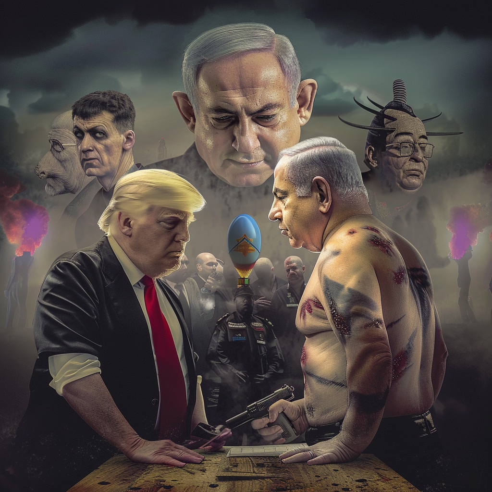

# WWIII Memecoin (WWIIIMeme)

Welcome to **WWIII Memecoin (WWIIIMeme)**, a novel cryptocurrency project that captures unfolding global events related to what's popularly dubbed as WW3 in a humorous and engaging meme format. Our aim is to document these significant moments while promoting peace and unity.

## Our Mission

WWMC uses the universal appeal of memes to comment on and encapsulate global events, ensuring our community remains informed and entertained, while emphasizing a message of peace and camaraderie.

## How It Works

Every tweet or post tagged with **#WWIIIMeme** will be considered for transformation into a meme on our site. Share your observations and insights with this hashtag to contribute to our global narrative!

## Disclaimer

**WWMC does not promote or glorify conflict.** Our objective is to offer satirical, meme-based commentary on world events, promoting peace and engaging in constructive dialogue. We respect all viewpoints and cultures and are committed to maintaining a respectful and engaging community.

## Get Involved

- **Stay Updated:** Follow our latest memes capturing global events.
- **Engage with Us:**
  - **Twitter:** [WWIII Memecoin on Twitter](https://twitter.com/WWIIIMeme)
  - **Telegram:** [WWIII Memecoin on Telegram](https://t.me/WWIIIMeme)
- **Participate:** Use the hashtag #WWIIIMeme on your social media posts to have them featured as memes on our site.
- **Support Peace:** By engaging with our content, you're contributing to a community that promotes peace through laughter.

Let's make history while documenting it—one meme at a time!
